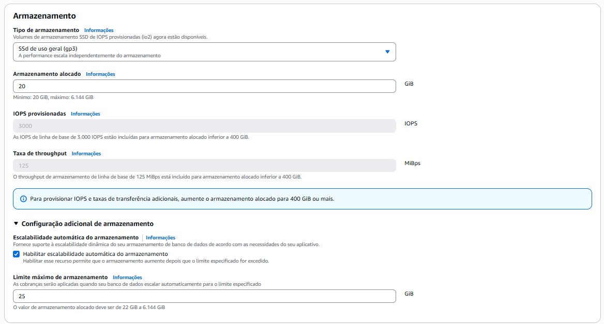
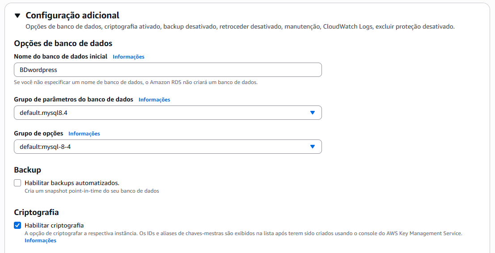

# Projeto 2 AWS-Docker

## Introdução 

Este projeto tem como objetivo a implementação de uma infraestrutura na AWS para hospedar uma aplicação WordPress utilizando contêineres Docker, garantindo alta disponibilidade, escalabilidade e gerenciamento eficiente dos recursos. A solução inclui:
- Instalação e configuração do Docker em instâncias EC2, com automação via script de inicialização.
- Execução da aplicação WordPress em contêineres, com banco de dados MySQL gerenciado pelo Amazon RDS.
- Configuração do Amazon EFS para armazenamento de arquivos estáticos compartilhados.
- Uso de Load Balancer da AWS para assegurar disponibilidade e resiliência.

---

## Sumário

- [Virtual Private Cloud (VPC)](#virtual-private-cloud-vpc)
- [Security Groups (SG)](#security-groups-sg)
  - [Configuração de Security Groups](#configuração-de-security-groups)
  - [Configuração de Regras de Segurança](#configuração-de-regras-de-segurança)
- [Relational Database Services (RDS)](#relational-database-services-rds)

---

## Virtual Private Cloud (VPC)

1. Abra o painel principal da AWS e pesquise por `VPC`.
2. Clique em `Suas VPCs`.
3. Clique em `Criar VPC`.


4. Após conferir se está igual as imagens, clique em `Criar VPC`.
5. Assim fica o Mapa de Recursos da sua VPC:


---

## Security Groups (SG)

Primeiro iremos criar os Security Groups vazios, para depois configurá-los, pois um depende do outro para funcionar. Portanto, todos devem estar criados para que possam se interligar.

1. Abra o painel principal da AWS e pesquise por `Grupos de Segurança`.
2. Clique em `Grupos de Segurança`.
3. Clique em `Criar grupo de segurança`.

### Configuração de Security Groups

#### 1. Security Group da EC2


#### 2. Security Group da RDS


#### 3. Security Group da EFS


#### 4. Security Group da LB


---

### Configuração de Regras de Segurança

#### 1. Configuração do Security Group da EC2

1. Selecione o grupo de segurança do EC2, clique em "**Ações**" e "**Editar regras de entrada**".

2. Em "**Regras de entrada**", clique em "**Adicionar regra**". Adicione as seguintes regras:

    - **SSH**:
        - **Tipo**: SSH
        - **Porta**: 22
        - **Tipo de origem**: Meu IP

    - **HTTP**:
        - **Tipo**: HTTP
        - **Porta**: 80
        - **Tipo de origem**: personalizado
        - **Origem**: grupo de segurança `lbSG`

    - **NFS**:
        - **Tipo**: NFS
        - **Porta**: 2049
        - **Tipo de origem**: personalizado
        - **Origem**: grupo de segurança `efsSG`

3. Clique em "**Salvar regras**".

4. Verifique as "**Regras de saída**":

    - **All traffic**:
        - **Tipo**: Todo o tráfego
        - **Porta**: Tudo
        - **Tipo de destino**: 0.0.0.0/0

---

#### 2. Configuração do Security Group do RDS

1. Selecione o grupo de segurança do RDS, clique em "**Ações**" e "**Editar regras de entrada**".

2. Em "**Regras de entrada**", clique em "**Adicionar regra**". Adicione a seguinte regra:

    - **MySQL/Aurora**:
        - **Tipo**: MySQL/Aurora
        - **Porta**: 3306
        - **Tipo de origem**: personalizado
        - **Origem**: grupo de segurança `ec2SG`

3. Clique em "**Salvar regras**".

4. Verifique as "**Regras de saída**":

    - **MySQL/Aurora**:
        - **Tipo**: MySQL/Aurora
        - **Porta**: 3306
        - **Tipo de destino**: grupo de segurança `ec2SG`

---

#### 3. Configuração do Security Group do EFS

1. Selecione o grupo de segurança do EFS, clique em "**Ações**" e "**Editar regras de entrada**".

2. Em "**Regras de entrada**", clique em "**Adicionar regra**". Adicione a seguinte regra:

    - **NFS**:
        - **Tipo**: NFS
        - **Porta**: 2049
        - **Tipo de origem**: personalizado
        - **Origem**: grupo de segurança `ec2SG`

3. Clique em "**Salvar regras**".

4. Verifique as "**Regras de saída**":

    - **NFS**:
        - **Tipo**: NFS
        - **Porta**: 2049
        - **Tipo de destino**: grupo de segurança `ec2SG`

---

#### 4. Configuração do Security Group do Load Balancer

1. Selecione o grupo de segurança do Load Balancer, clique em "**Ações**" e "**Editar regras de entrada**".

2. Em "**Regras de entrada**", clique em "**Adicionar regra**". Adicione a seguinte regra:

    - **HTTP**:
        - **Tipo**: HTTP
        - **Porta**: 80
        - **Tipo de origem**: 0.0.0.0/0

3. Clique em "**Salvar regras**".

4. Verifique as "**Regras de saída**":

    - **HTTP**:
        - **Tipo**: HTTP
        - **Porta**: 80
        - **Tipo de destino**: grupo de segurança `ec2SG`

---

## Par de Chaves

1. Abra o painel principal da AWS e pesquise por `Pares de chaves`.
2. Clique em `Criar par de chaves`.
3. Nomeie como `chave`, selecione `RSA` e `.pem`.

---

## Relational Database Services (RDS)

1. Na barra de pesquisa do console AWS, procure por "**RDS**".

2. Na página inicial do serviço, clique em "**Criar banco de dados**". 

3. Selecione "**Criação padrão**".

4. Em "**Opções de mecanismo**", selecione o banco de dados "**MySQL**" e escolha a versão de mecanismo mais recente.

5. Em "**Modelos**", selecione "**Nível gratuito**".

6. Em "**Configurações**", dê um nome descritivo à instância do banco de dados.

7. Em "**Configurações de credenciais**", digite um nome de usuário para a instância do banco de dados. Esse será o ID do usuário principal do banco de dados.

8. Em "**Gerenciamento de credenciais**", selecione "**Autogerenciada**". Nessa opção você irá criar uma senha.

9. Em "**Configuração da instância**", selecione "**db.t3.micro**".

10. Em "**Armazenamento**", deixe igual à imagem abaixo:
    


### Configurações de Rede

1. Em "**Conectividade**", selecione "**Não se conectar a um recurso de computação do EC2**". Iremos configurar a conexão às instâncias do EC2 manualmente mais tarde.

2. Em "**Nuvem privada virtual (VPC)**", selecione a VPC criada para o projeto.

3. Em "**Grupo de sub-redes de banco de dados**", selecione a opção "**Criar novo grupo de sub-redes do banco de dados**".

4. Em "**Acesso público**", selecione a opção "**Não**".

5. Em "**Grupo de segurança de VPC (firewall)**", selecione a opção "**Selecionar existente**", e, em "**Grupos de segurança da VPC existentes**", selecione o **grupo de segurança do RDS** criado anteriormente.

6. Em "**Zona de disponibilidade**", selecione a opção "**Sem preferência**".

### Configurações de Autenticação 

1. Em "**Autenticação de banco de dados**", selecione a opção "**Autenticação de senha**".

### Configurações Adicionais

1. Em "**Nome do banco de dados inicial**", dê um nome descritivo ao banco de dados.



2. Mantenha as demais configurações (Criptografia, Logs, etc.) padrão.

3. Em "**Custos mensais estimados**", revise as informações e certifique-se de que o uso se enquadra no nível gratuito.

4. Se tudo estiver conforme configurado nas etapas anteriores, clique em "**Criar banco de dados**".

---

## Elastic File System (EFS)

Iremos configurar um sistema de arquivos elástico para que as instâncias que hospedam o WordPress possam compartilhar arquivos mesmo em diferentes zonas de disponibilidade.

#### 4.1 Configurações Gerais

1. Na barra de pesquisa do console AWS, procure por "**EFS**".

2. Na página inicial do serviço, clique em "**Criar sistema de arquivos**" e "**Personalizar**".

3. Dê um nome ao sistema de arquivos.

4. Em "**Tipo do sistema de arquivos**", selecione "**Regional**".

5. Mantenha as **configurações gerais** padrão:

    - Backup automático: **Desabilitado**
    - Gerenciamento de ciclo de vida: 
        - Transição para Infrequent Access: **Nenhum**
        - Transição para Archive: **Nenhum**
        - Transição para o Padrão: **Nenhum**
    - Criptografia: **Habilitado**

6. Mude **configurações de performance**:

    - Modo de taxa de transferência: "**Intermitente**"

7. Verifique as **configurações adicionais** e cerfique-se de que "**Uso geral**" está selecionado. 

8. Opcionalmente, adicione tags descritivas ao sistema de arquivos para melhorar a identificação dos recursos.

9. Clique em "**Próximo**".

#### 4.2 Configurações de Rede

1. Em "**Rede**", selecione a VPC criada para o projeto. 

2. Em "**Destinos de montagem**", adicionaremos dois destinos de montagem, um para cada zona de disponibilidade: 

    AZ 1:
    - Zona de disponibilidade: "**us-east-1a**"
    - ID da sub-rede: selecione a **sub-rede privada** disponível
    - Endereço de IP: mantenha o padrão ("**Automático**")
    - Grupos de segurança: selecione o **grupo de segurança do EFS**
   
    AZ 2:
    - Zona de disponibilidade: "**us-east-1b**"
    - ID da sub-rede: selecione a **sub-rede privada** disponível
    - Endereço de IP: mantenha o padrão ("**Automático**")
    - Grupos de segurança: selecione o **grupo de segurança do EFS**

3. Clique em "**Próximo**".

#### 4.3 Política do Sistema de Arquivos

Mantenha todas as opções como padrão e clique em "**Próximo**".

#### 4.4 Revisão das Configurações

Nessa etapa, verifique todas as configurações. Se tudo estiver conforme configurado nas etapas anteriores, clique em "**Criar**".

Após isso, copie o ID do sistema de arquivos, pois será usado mais tarde.

---

## Modelo de Execução

1. Abra o painel principal da AWS e pesquise por `EC2`.
2. Clique em `Modelos de Execução`.
3. Clique em `Criar modelo de execução`.
4. Preencha as seguintes informações:
   1. **Nome e Descrição**: Dê um nome e uma descrição ao modelo de execução.
   2. **Imagens de Aplicação e de Sistema Operacional**: Selecione a AMI do Amazon Linux.
   3. **Tipo de Instância**: Escolha `t2.micro`.
   4. **Par de Chaves**: Selecione o par de chaves criado anteriormente.
   5. **Configurações de Rede**:
      - Selecione `Não incluir no modelo de execução`.
      - Em `Firewall`, selecione o grupo de segurança das instâncias do EC2.
   6. **Detalhes Avançados**:
      - Mantenha as opções padrão.
      - Vá até a última opção, `Dados do Usuário`, para adicionar o script de inicialização.

5. Crie um **script de inicialização** para ambas as instâncias do EC2. O script será usado para configurar o ambiente e iniciar os serviços necessários.

```sh
#!/bin/bash

# ---------------------- CONFIGURAÇÕES INICIAIS ------------------------

# Identificador do sistema de arquivos EFS da AWS
EFS_ID="fs-xxxxxxxx"  # Substitua pelo seu File System ID

# Informações de conexão com o banco de dados
MYSQL_HOST="database.example.com"
MYSQL_DATABASE="wordpress_db"
MYSQL_USER="wp_user"
MYSQL_PASS="strong_password_here"

# Caminhos e versões
COMPOSE_VER="v2.34.0"
APP_DIR="/home/ec2-user/wordpress-app"
MOUNT_PATH="/mnt/aws-efs"

# ---------------------- INSTALAÇÃO DE DEPENDÊNCIAS --------------------

# Atualiza os pacotes do sistema
yum update -y

# Instala a AWS CLI (útil para operações com serviços da AWS)
yum install -y aws-cli

# Instala o Docker e ativa seu serviço
yum install -y docker
systemctl start docker
systemctl enable docker

# Adiciona o usuário padrão ao grupo Docker (evita uso do sudo)
usermod -aG docker ec2-user

# Instala o Docker Compose em sua versão especificada
curl -L "https://github.com/docker/compose/releases/download/${COMPOSE_VER}/docker-compose-linux-x86_64" -o /usr/local/bin/docker-compose
chmod +x /usr/local/bin/docker-compose

# --------------------- MONTAGEM DO ARMAZENAMENTO EFS ------------------

# Instala utilitários do EFS
yum install -y amazon-efs-utils

# Cria o diretório onde o EFS será montado
mkdir -p "${MOUNT_PATH}"

# Faz a montagem do EFS no diretório criado
mount -t efs "${EFS_ID}":/ "${MOUNT_PATH}"

# Garante que a montagem persista após reinicializações
echo "${EFS_ID}:/ ${MOUNT_PATH} efs defaults,_netdev 0 0" >> /etc/fstab

# Ajusta as permissões para que o usuário www-data (id 33) tenha controle
chown -R 33:33 "${MOUNT_PATH}"

# ------------------------ CRIAÇÃO DO PROJETO --------------------------

# Cria o diretório do projeto e navega até ele
mkdir -p "${APP_DIR}"
cd "${APP_DIR}"

# Cria o arquivo docker-compose.yml com o serviço WordPress
cat <<EOF > docker-compose.yml
version: '3.8'

services:
  wordpress:
    image: wordpress:latest
    container_name: wp_app
    environment:
      WORDPRESS_DB_HOST: ${MYSQL_HOST}
      WORDPRESS_DB_NAME: ${MYSQL_DATABASE}
      WORDPRESS_DB_USER: ${MYSQL_USER}
      WORDPRESS_DB_PASSWORD: ${MYSQL_PASS}
    ports:
      - "80:80"
    volumes:
      - ${MOUNT_PATH}:/var/www/html
EOF

# ------------------------ EXECUÇÃO DO CONTAINER ------------------------

# Inicia o container do WordPress em segundo plano
docker-compose up -d
```

6. Clique em `Criar modelo de execução`

---

## Load Balancer (LB)

Siga os passos abaixo para configurar um **Classic Load Balancer** na AWS:

1. Abra o painel principal da AWS e pesquise por `Load Balancers`.
2. Clique em `Balanceador de Carga`.
3. Clique em `Criar balanceador de carga`.
4. Clique na setinha em `Classic Load Balancer`.


5. Dê um nome para o Load Balancer:
   - Nome: `LB-Projeto`.

6. Em **Esquema**, selecione:
   - `Voltado para a Internet`.

7. Em **VPC**, selecione a criada anteriormente.

8. Marque as seguintes opções:
   - Marque as 2 AZ.
   - Selecione a **subnet pública** de cada AZ.

9. Selecione o Security Group do Load Balancer:
   - `lbSG`.

10. Configure o Health Check com as seguintes opções:
    1. **Caminho de Ping**: `/wp-admin/install.php`.
    2. **Tempo limite de resposta**: `5`.
    3. **Intervalo**: `15`.
    4. **Limite não íntegro**: `2`.
    5. **Limite íntegro**: `3`.

11. Clique em `Create Load Balancer`.

---

## Auto Scaling Group (ASG)

1. Abra o painel principal da AWS e pesquise por `Grupos Auto Scaling`.
2. Clique em `Criar grupo do Auto Scaling`.
3. De um nome.
4. Escolha o Modelo de Execução criado anteriormente.
5. 
**Configurações**:
- **VPC:** Selecione a criada anteriormente.
- **Subnets:** Escolha as subredes **privadas**.
- **Load Balancer:** Selecione o Load Balancer criado anteriormente.

**Configuração de Capacidade**:
- **Capacidade desejada:** `2`.
- **Capacidade mínima:** `2`.
- **Capacidade máxima:** `4`.

**Outras Configurações**:
- Habilite `Elastic Load Balancing health checks`.
- Configure o Health Check Grace Period conforme necessário (padrão: `300` segundos).
- Marque o checkbox para habilitar `group metrics collection within CloudWatch`.

Por fim, clique em `Create Auto Scaling group`.

---
