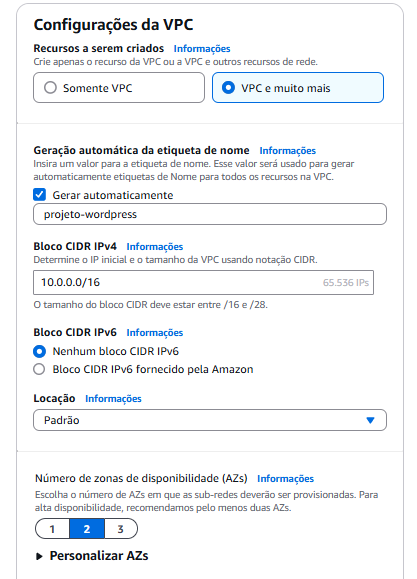
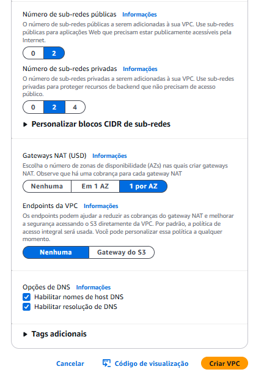
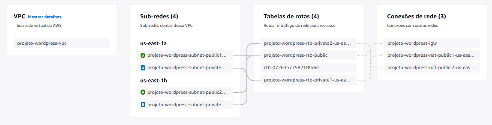
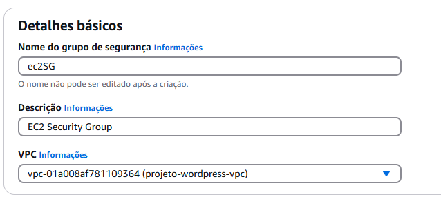
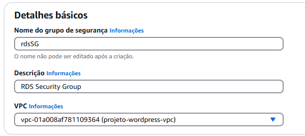
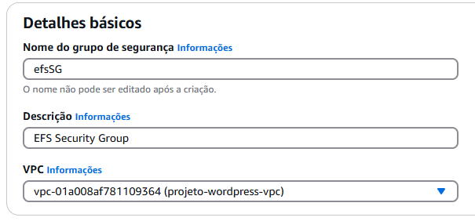
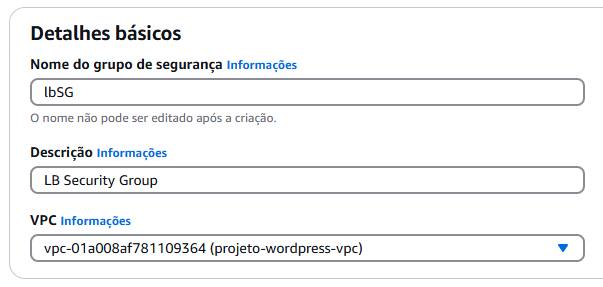

# Projeto 2 AWS-Docker

## Introdução 

Este projeto tem como objetivo a implementação de uma infraestrutura na AWS para hospedar uma aplicação WordPress utilizando contêineres Docker, garantindo alta disponibilidade, escalabilidade e gerenciamento eficiente dos recursos. A solução inclui:
- Instalação e configuração do Docker em instâncias EC2, com automação via script de inicialização.
- Execução da aplicação WordPress em contêineres, com banco de dados MySQL gerenciado pelo Amazon RDS.
- Configuração do Amazon EFS para armazenamento de arquivos estáticos compartilhados.
- Uso de Load Balancer da AWS para assegurar disponibilidade e resiliência.

---

## Sumário

- [Virtual Private Cloud (VPC)](#virtual-private-cloud-vpc)
- [Security Groups (SG)](#security-groups-sg)
- [Relational Database Services (RDS)](#relational-database-services-rds)
- [Elastic File System (EFS)](#elastic-file-system-efs)
- [Key Pairs (KP)](#key-pairs-kp)
- [Launch Template (LT)](#launch-template-lt)
- [Load Balancer (LB)](#load-balancer-lb)
- [Auto Scaling Group (ASG)](#auto-scaling-group-asg)

---

## Virtual Private Cloud (VPC)

1. Abra o painel principal da AWS e pesquise por `VPC`.
2. Clique em `Suas VPCs`.
3. Clique em `Criar VPC`.




4. Após conferir se está igual as imagens, clique em `Criar VPC`.
5. Assim fica o Mapa de Recursos da sua VPC.



---

## Security Groups (SG)

Primeiro iremos criar os Security Groups vazios, para depois configurá-los, pois um depende do outro para funcionar e portanto, todos devem estar criados para que possam se interligar.

1. Abra o painel principal da AWS e pesquise por `Grupos de Segurança`.
2. Clique em `Grupos de Segurança`.
3. Clique em `Criar grupo de segurança`.


### Configurações dos Security Groups

#### 1. Security Group da EC2.



---

#### 2. Security Group da RDS.



---

#### 3. Security Group da EFS.



---

#### 4. Security Group da LB.


---

## Relational Database Services (RDS)

1. Abra o painel principal da AWS e pesquise por `RDS`.
2. Clique em `Databases` > `Create Database`.
3. Escolha `MySQL` como engine e selecione a versão mais recente.
4. Configure como `Free tier` e `Single-AZ DB instance deployment`.

**Configuração do Banco de Dados**:
- **Nome:** `database-project2`
- **Usuário:** `admin`
- **Senha:** Crie uma senha forte e guarde-a.

**Configuração da Rede**:
- **VPC:** Selecione a VPC criada anteriormente.
- **Security Group:** `rds_SG`.

Por fim, clique em `Create database`.

---

## Elastic File System (EFS)

1. Abra o painel principal da AWS e pesquise por `EFS`.
2. Clique em `File systems` > `Create file system`.
3. Nomeie como `FS-Project2` e selecione a VPC criada anteriormente.

**Configuração de Subnets**:
- Escolha as subnets privadas da VPC (ex.: `us-east-1a` e `us-east-1b`).
- Security Group: `efs_SG`.

Por fim, clique em `Create`.

> **Importante**: Anote o ID do EFS, pois será utilizado no UserData.

---

## Key Pairs (KP)

1. Abra o painel principal da AWS e pesquise por `Key pairs`.
2. Clique em `Create key pairs`.
3. Nomeie como `key-project2`, selecione `RSA` e `.pem`.

---

## Launch Template (LT)

1. Abra o painel principal da AWS e pesquise por `EC2`.
2. Clique em `Launch templates` > `Create launch template`.

**Configurações**:
- **Nome:** `MyTemplateWordPress`
- **AMI:** `Amazon Linux`.
- **Tipo de instância:** `t2.micro`.
- **Key Pair:** `key-project2`.
- **Security Group:** `ec2_SG`.

**UserData**:
```bash
#!/bin/bash
# Script de inicialização da instância
EFS_FILE_SYSTEM_ID="<seu_file_id_aqui>"
DB_HOST="<seu_host_do_banco_de_dados_aqui>"
DB_NAME="<seu_nome_do_banco_de_dados_aqui>"
DB_USER="<seu_usuario_do_banco_aqui>"
DB_PASSWORD="<sua_senha_do_banco_aqui>"

# Instalação e configuração do Docker
yum update -y
yum install -y docker
service docker start
systemctl enable docker
usermod -a -G docker ec2-user

# Docker Compose
curl -SL https://github.com/docker/compose/releases/download/v2.34.0/docker-compose-linux-x86_64 -o /usr/local/bin/docker-compose
chmod +x /usr/local/bin/docker-compose

# Montagem do EFS
yum install -y amazon-efs-utils
mkdir -p /mnt/efs
mount -t efs ${EFS_FILE_SYSTEM_ID}:/ /mnt/efs
echo "${EFS_FILE_SYSTEM_ID}:/ /mnt/efs efs defaults,_netdev 0 0" >> /etc/fstab
```

Clique em `Create launch template`.

---

## Load Balancer (LB)

1. Abra o painel principal da AWS e pesquise por `Load Balancers`.
2. Clique em `Create load balancer` > `Classic Load Balancer`.
3. Configure como `Internet-facing` e selecione as subnets **públicas**.
4. Associe o Security Group: `lb_SG`.
5. Configure o `Ping Path` como `/wp-admin/install.php`.

Por fim, clique em `Create load balancer`.

---

## Auto Scaling Group (ASG)

1. Abra o painel principal da AWS e pesquise por `Auto scaling groups`.
2. Clique em `Create Auto Scaling group`.

**Configurações**:
- **Nome:** `ASG-Project2`.
- **Launch Template:** Selecione o template criado anteriormente.
- **VPC:** Selecione a criada anteriormente.
- **Subnets:** Escolha as subnets **privadas**.
- **Load Balancer:** Selecione o Load Balancer criado anteriormente.

**Configuração de Capacidade**:
- **Desired capacity:** `2`.
- **Min desired capacity:** `2`.
- **Max desired capacity:** `4`.

**Outras Configurações**:
- Habilite `Elastic Load Balancing health checks`.
- Configure o Health Check Grace Period conforme necessário (padrão: `300` segundos).
- Marque o checkbox para habilitar `group metrics collection within CloudWatch`.

Por fim, clique em `Create Auto Scaling group`.

---
